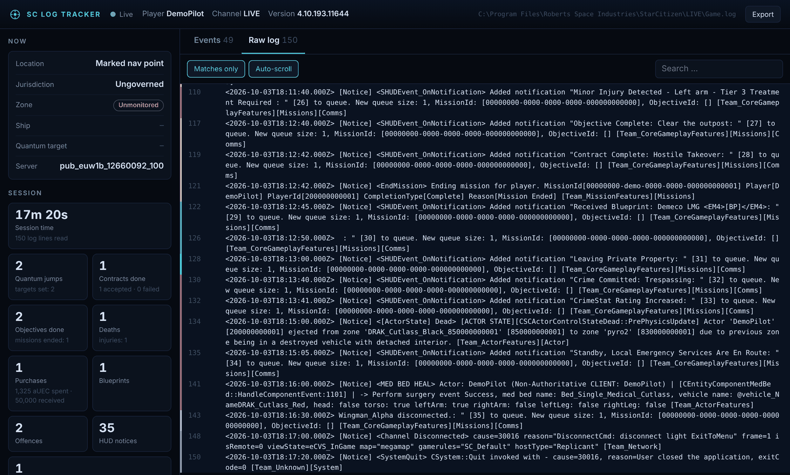

<div align="center">


# SC Log Tracker

**See what's happening in your Star Citizen session, live.**
SC Log Tracker follows your `Game.log` while you play, turns the raw lines into readable events and shows them in a clean dashboard in your browser.

[](https://github.com/DefaultHahn/sc-log-tracker/actions/workflows/ci.yml)
[](https://github.com/DefaultHahn/sc-log-tracker/releases/latest)
[](https://www.python.org/downloads/)
[](#download)
[](LICENSE)


</div>

## Features

- **Live event feed:** quantum jumps, locations, jurisdictions, armistice zones, ships you board, contracts and objectives, purchases, blueprints, injuries, deaths, crimes, party activity, crashes and disconnects.
- **"Now" panel:** where you are, which jurisdiction you're in, whether you're in an armistice or monitored zone, your ship, your quantum target and your server.
- **Session statistics:** play time, quantum jumps, contracts, purchases and aUEC spent, blueprints, offences and problems.
- **Readable names:** internal codes like `RR_P3_LEO` or `Outpost_OLP_Stanton2b_Attritus` become `Orbituary` and `Attritus (Daymar)`.
- **Raw log view:** the last lines of the log, with recognized lines highlighted, plus search, a "matches only" filter and auto-scroll.
- **Filters and search:** show only the categories you care about. Click an event to see the original log line.
- **Replay:** play back any old session from `logbackups`, as fast as you like.
- **Export:** save a session's events as JSON.
- **Zero setup:** one file, no dependencies, works offline, finds your `Game.log` on its own.

## Download

### Option A: Windows app (no Python needed)

1. Download **[SC-Log-Tracker.exe](https://github.com/DefaultHahn/sc-log-tracker/releases/latest/download/SC-Log-Tracker.exe)** from the [latest release](https://github.com/DefaultHahn/sc-log-tracker/releases/latest).
2. Put it in any folder and double-click it.
3. Your browser opens the dashboard at `http://127.0.0.1:8777`.

> **Windows SmartScreen** may say "Windows protected your PC" the first time. That's because the app isn't code-signed (a certificate costs money every year). Click **More info → Run anyway**. The exe is built from this repository's source by GitHub Actions; you can check every step in the [release workflow](.github/workflows/release.yml).

### Option B: Python

You need [Python 3.9 or newer](https://www.python.org/downloads/). Tick *Add python.exe to PATH* when installing.

```bash
git clone https://github.com/DefaultHahn/sc-log-tracker.git
cd sc-log-tracker
python sc_log_tracker.py
```

Or download the source zip from the [latest release](https://github.com/DefaultHahn/sc-log-tracker/releases/latest) and double-click `start.bat`.

## Usage

Start the tracker before or after the game, it doesn't matter. It reads the current session so far and then follows along live. When you restart Star Citizen, it notices the new `Game.log` and starts a fresh session.

The tracker looks for the `Game.log` in the RSI Launcher's log and in the usual install folders on all drives. If it can't find it, it asks for the path once and remembers it in `sc_log_tracker.json` next to the app.

```text
sc_log_tracker.py [path] [options]

  path                  Game.log, LIVE folder or StarCitizen folder (optional)
  --replay FILE         replay an old log ("last" = newest file in logbackups)
  --speed N             replay speed, default 30 (= 30x real time)
  --port N              web port, default 8777
  --no-browser          don't open the browser automatically
  --quiet               don't print events to the console
  --no-color            plain console output
  --version             show the version
```

Examples:

```bash
python sc_log_tracker.py "D:\Games\StarCitizen\PTU"      # follow the PTU instead of LIVE
python sc_log_tracker.py --replay last                     # replay your last session
python sc_log_tracker.py --replay examples/demo_game.log   # try it without the game
```

The `.exe` takes the same options, e.g. `SC-Log-Tracker.exe --replay last`.

### In the dashboard

| | |
|---|---|
| **Category chips** | Click to show or hide a category. Double-click to show only that one. |
| **Event row** | Click to show the original log line. |
| **Raw log** | Scroll up to pause auto-scroll, scroll to the bottom to resume. |
| **Export** | Downloads the session's events as JSON. |



## Is this safe to use?

**Anti-cheat:** SC Log Tracker only reads the text file the game writes itself, the same file you'd attach to a bug report. It never touches the game process: no memory reading, no injection, no hooks, no network traffic inspection, no changes to game files. The file is opened briefly on every check and closed again.

**Privacy:** everything stays on your PC. The dashboard is only reachable from your own computer (`127.0.0.1`). The tracker doesn't send anything anywhere and doesn't need an internet connection.

## Limitations

- **Kills, K/D and your aUEC balance** are no longer written to the `Game.log` since the 2026 builds (combat and wallet moved server-side). Kill lines from older patches (4.1 to 4.3) are still recognized.
- **Deaths** are only logged in some cases, for example when your ship is destroyed. The death count is a lower bound.
- **No live coordinates.** The log names places, not positions.
- **The log format changes with patches.** Messages the tracker doesn't know yet still show up as "HUD notice", so nothing gets lost. If something looks wrong after a patch, please [open an issue](https://github.com/DefaultHahn/sc-log-tracker/issues/new/choose).

Tested against Star Citizen **4.10** (build 12660092) with 31 real play sessions (about 1.3 million log lines).

## How it works

```text
Game.log ──► tailer ──► parser ──► local web server ──► your browser
            (polls 4×/s)  (lines → events)  (127.0.0.1, server-sent events)
```

The whole app is a single Python file using only the standard library: [`sc_log_tracker.py`](sc_log_tracker.py). The parser recognizes HUD notifications (the pop-ups you see in game, logged since 4.5) and about 25 other kinds of log lines, then de-duplicates the noisy ones, for example jurisdiction flips at a border or party members reconnecting on every server transfer.

## FAQ

<details>
<summary><b>It can't find my Game.log</b></summary>

Start it with the path to your Star Citizen folder, e.g. `SC-Log-Tracker.exe "D:\Games\Roberts Space Industries\StarCitizen"`. It picks the most recently used channel (LIVE, PTU, ...) and remembers the path.
</details>

<details>
<summary><b>The browser doesn't open</b></summary>

Open `http://127.0.0.1:8777` yourself. If port 8777 is taken, the tracker uses the next free one and prints it in the console window.
</details>

<details>
<summary><b>My antivirus complains about the exe</b></summary>

Unsigned apps packaged with PyInstaller are sometimes flagged by mistake. If you'd rather not run the exe, use the Python version; it's the same code.
</details>

<details>
<summary><b>Can I see a session from last week?</b></summary>

Yes, Star Citizen keeps old logs in `StarCitizen\LIVE\logbackups`. Use `--replay "path\to\that.log"` or `--replay last` for the newest one.
</details>

## Contributing

Bug reports, missing log lines and pull requests are welcome. See [CONTRIBUTING.md](CONTRIBUTING.md) for how to run the tests and add new log patterns.

When you share log lines, **remove personal information first**: your handle, player ID (`playerGEID`), other players' names and IP addresses.

## License

[MIT](LICENSE) © DefaultHahn

---

<sub>This is an unofficial fan project and is not affiliated with or endorsed by Cloud Imperium Games. Star Citizen®, Roberts Space Industries® and Cloud Imperium® are registered trademarks of Cloud Imperium Rights LLC.</sub>
