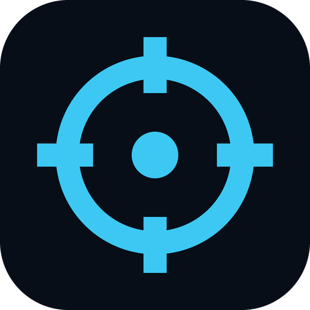
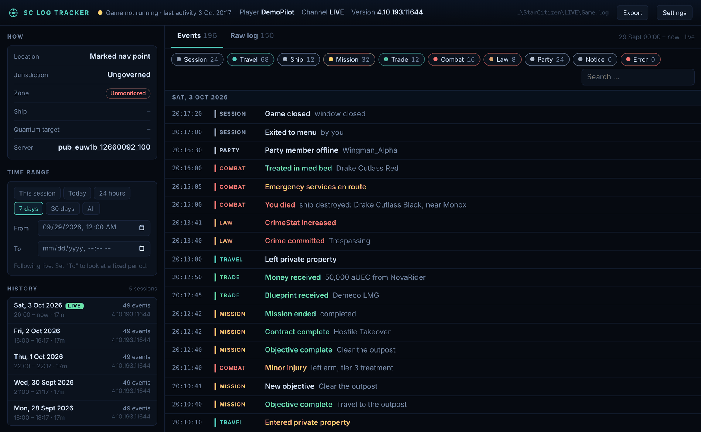
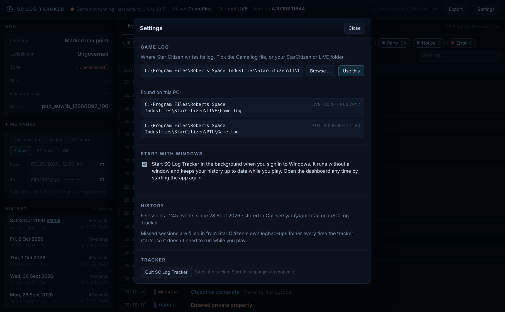

<div align="center">



# SC Log Tracker

**See what's happening in your Star Citizen sessions, live and in a complete history.**
SC Log Tracker follows your `Game.log` while you play, turns the raw lines into readable events, keeps every session in its own archive and shows it all in a clean dashboard in your browser.

[](https://github.com/DefaultHahn/sc-log-tracker/actions/workflows/ci.yml)
[](https://github.com/DefaultHahn/sc-log-tracker/releases/latest)
[](https://www.python.org/downloads/)
[](#download)
[](LICENSE)



</div>

## Features

- **Live event feed:** quantum jumps, locations, jurisdictions, armistice zones, ships you board, contracts and objectives, purchases, blueprints, injuries, deaths, crimes, party activity, crashes and disconnects.
- **Complete history:** every session is saved to a local archive. On every start the tracker also imports the logs Star Citizen keeps in `logbackups`, so sessions you played while it wasn't running are filled in, going back as far as those backups go.
- **Time range filter:** look at this session, today, the last 7 or 30 days, everything, or any period you pick by date and time. Click a session in the history list to jump to it.
- **"Now" panel:** where you are, which jurisdiction you're in, whether you're in an armistice or monitored zone, your ship, your quantum target and your server.
- **Readable names:** internal codes like `RR_P3_LEO` or `Outpost_OLP_Stanton2b_Attritus` become `Orbituary` and `Attritus (Daymar)`.
- **Runs quietly:** no console window, optional start with Windows, and a single instance. Starting the app again just opens the dashboard.
- **Works with any install folder:** it finds your `Game.log` on its own, or you pick it in the settings.
- **Raw log view, filters, search and JSON export.**
- **Zero setup:** one file, no dependencies, works offline.

## Download

### Option A: Windows app (no Python needed)

1. Download **[SC-Log-Tracker.exe](https://github.com/DefaultHahn/sc-log-tracker/releases/latest/download/SC-Log-Tracker.exe)** from the [latest release](https://github.com/DefaultHahn/sc-log-tracker/releases/latest).
2. Put it in any folder and double-click it.
3. Your browser opens the dashboard at `http://127.0.0.1:8777`. The first start imports your old sessions in the background, which takes a few seconds to a minute.

The app has no window of its own. It keeps running in the background until you click **Settings → Quit SC Log Tracker**. Double-clicking it again simply reopens the dashboard.

> **Windows SmartScreen** may say "Windows protected your PC" the first time. That's because the app isn't code-signed (a certificate costs money every year). Click **More info → Run anyway**. The exe is built from this repository's source by GitHub Actions; you can check every step in the [release workflow](.github/workflows/release.yml).

### Option B: Python

You need [Python 3.9 or newer](https://www.python.org/downloads/). Tick *Add python.exe to PATH* when installing.

```bash
git clone https://github.com/DefaultHahn/sc-log-tracker.git
cd sc-log-tracker
python sc_log_tracker.py
```

Or download the source zip from the [latest release](https://github.com/DefaultHahn/sc-log-tracker/releases/latest) and double-click `start.bat`. The Python version also prints events to its console window.

## Usage

### Finding your Game.log

The tracker looks for the `Game.log` in the RSI Launcher's log and in the usual install folders on all drives. If you installed Star Citizen somewhere else, or want to follow the PTU instead of LIVE, open **Settings** (or click the path in the top bar). There you can:

- pick one of the installations it found,
- click **Browse ...** to choose the `Game.log` with the normal Windows file dialog,
- or paste the path to the `Game.log`, your `StarCitizen` folder or your `LIVE` folder.

If it can't find anything on the first start, the settings open by themselves. Your choice is remembered.

### History and time range

You don't need to keep the tracker running while you play: Star Citizen moves every finished session's log to `StarCitizen\LIVE\logbackups`, and the tracker imports anything new from there each time it starts. Its own archive keeps the events even after those backups are gone, for example after a reinstall.

Use **Time range** on the left to choose what the event feed shows. Leave **To** empty to keep following live; set it to look at a fixed period. The **History** list shows every session with its date, length and number of events.

### Start with Windows

Turn on **Settings → Start with Windows** to have the tracker start in the background when you sign in. Your history then fills up live while you play, and the dashboard is one double-click away. Turn it off the same way. (This adds an entry for your user only, under *Settings → Apps → Startup* in Windows.)

### Where your data is stored

Settings and the history live in `%LOCALAPPDATA%\SC Log Tracker` (on other systems `~/.local/share/sc-log-tracker`). Copy that folder to move your history to another PC. Deleting it starts from scratch; the next start re-imports whatever is still in `logbackups`.

### Command-line options

```text
sc_log_tracker.py [path] [options]

  path                  Game.log, LIVE folder or StarCitizen folder (optional)
  --background          no browser, no console output (used for "Start with Windows")
  --replay FILE         replay a log file without saving it ("last" = newest file in logbackups)
  --speed N             replay speed, default 30 (= 30x real time)
  --port N              web port, default 8777
  --data-dir DIR        where settings and history are stored
  --no-browser          don't open the browser automatically
  --quiet               don't print events to the console
  --no-color            plain console output
  --version             show the version
```

The `.exe` takes the same options, e.g. `SC-Log-Tracker.exe --replay last`. To try the dashboard without the game: `python sc_log_tracker.py --replay examples/demo_game.log`.

### In the dashboard

| | |
|---|---|
| **Category chips** | Click to show or hide a category. Double-click to show only that one. |
| **Event row** | Click to show the original log line. |
| **History list** | Click a session to show just that session. |
| **Raw log** | The current game session's lines. Scroll up to pause auto-scroll. |
| **Export** | Downloads the events of the selected time range as JSON. |



## Is this safe to use?

**Anti-cheat:** SC Log Tracker only reads the text files the game writes itself, the same `Game.log` you'd attach to a bug report. It never touches the game process: no memory reading, no injection, no hooks, no network traffic inspection, no changes to game files. The log is opened briefly on every check and closed again.

**Privacy:** everything stays on your PC. The dashboard is only reachable from your own computer (`127.0.0.1`) and refuses requests from other websites. The tracker doesn't send anything anywhere and doesn't need an internet connection.

## Limitations

- **Kills, K/D and your aUEC balance** are no longer written to the `Game.log` since the 2026 builds (combat and wallet moved server-side). Your kills from older patches (4.1 to 4.3) are still recognized and show up in the history.
- **Deaths** are only logged in some cases, for example when your ship is destroyed.
- **No live coordinates.** The log names places, not positions.
- **The raw log** is only shown for the current game session; the history keeps the recognized events.
- **The log format changes with patches.** Messages the tracker doesn't know yet still show up as "HUD notice", so nothing gets lost. When a new version learns more, sessions whose logs still exist are re-imported automatically. If something looks wrong after a patch, please [open an issue](https://github.com/DefaultHahn/sc-log-tracker/issues/new/choose).

Tested against Star Citizen **4.3 to 4.10** with 238 real play sessions (about 5.7 million log lines). Importing all of them took under 20 seconds.

## How it works

```text
Game.log ──────► tailer ─┐
                         ├─► parser ─► history (SQLite) ─► local web server ─► your browser
logbackups/*.log ► importer ┘   (lines → events)          (127.0.0.1, server-sent events)
```

The whole app is a single Python file using only the standard library: [`sc_log_tracker.py`](sc_log_tracker.py). The parser recognizes HUD notifications (the pop-ups you see in game, logged since 4.5) and about 25 other kinds of log lines, then de-duplicates the noisy ones, for example jurisdiction flips at a border or party members reconnecting on every server transfer.

## FAQ

<details>
<summary><b>It can't find my Game.log</b></summary>

Open **Settings** and click **Browse ...**, or paste the path to your Star Citizen folder. It picks the most recently used channel (LIVE, PTU, ...) and remembers it.
</details>

<details>
<summary><b>How do I stop it?</b></summary>

**Settings → Quit SC Log Tracker**. If you started the Python version in a console, Ctrl+C works too.
</details>

<details>
<summary><b>Do I have to start it every time I play?</b></summary>

No. Sessions you played without it are imported from Star Citizen's `logbackups` the next time you open it. Turn on **Start with Windows** if you want the history to update live while you play.
</details>

<details>
<summary><b>The browser doesn't open</b></summary>

Open `http://127.0.0.1:8777` yourself. If port 8777 is taken, the tracker uses the next free one (up to 8791).
</details>

<details>
<summary><b>My antivirus complains about the exe</b></summary>

Unsigned apps packaged with PyInstaller are sometimes flagged by mistake. If you'd rather not run the exe, use the Python version; it's the same code.
</details>

## Contributing

Bug reports, missing log lines and pull requests are welcome. See [CONTRIBUTING.md](CONTRIBUTING.md) for how to run the tests and add new log patterns.

When you share log lines, **remove personal information first**: your handle, player ID (`playerGEID`), other players' names and IP addresses.

## License

[MIT](LICENSE) © DefaultHahn

---

<sub>This is an unofficial fan project and is not affiliated with or endorsed by Cloud Imperium Games. Star Citizen®, Roberts Space Industries® and Cloud Imperium® are registered trademarks of Cloud Imperium Rights LLC.</sub>
